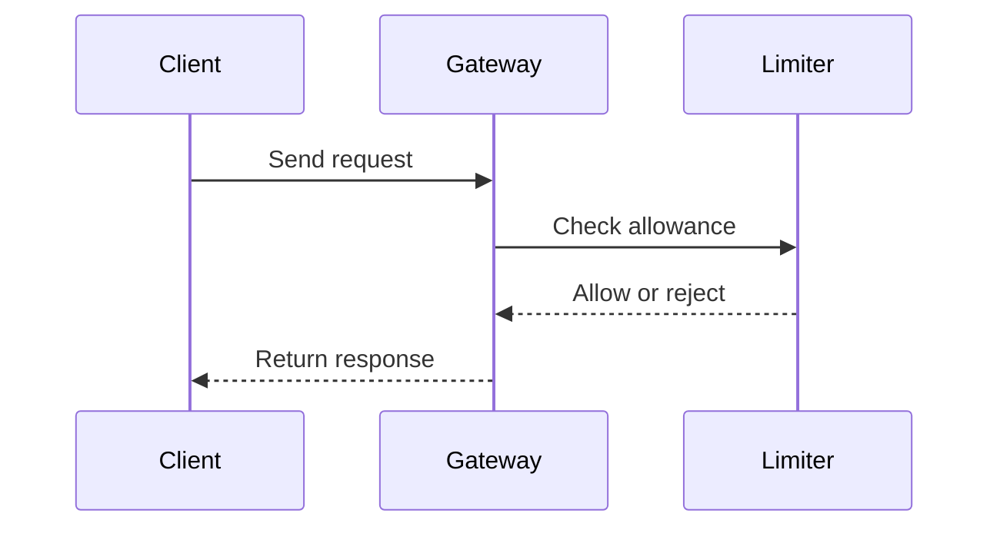

# HOW_TO_WRITE_PLAN

Write plans for rapid scanning and low cognitive load. Prefer explicit
decisions, constraints, and tradeoffs over narrative filler.

## Mandatory formatting

- Keep every prose line at or below 80 characters. Reflow dense paragraphs
  into short paragraphs or bullets.
- Use exactly one blank line between paragraphs and structural blocks.
- Start with an H2 title that names the plan and its context.
- Put compact metadata under the title using H4 headings or badge-style text.
- Keep the opening context to three lines or fewer.
- Present the problem as a bulleted list.
- Use `---` between distinct phases, such as token generation and request
  authentication.
- Use blockquotes for warnings and key takeaways.
- Keep sections focused. Split dense reasoning into named subsections.

## Tables

Use a standard Markdown table whenever comparing rate limits, token costs, or
technical specifications. Include a header row and keep columns visually
balanced. Shorten labels or split a table when rows become difficult to scan.

Prefer columns such as:

| Scope | Limit | Window | Expiration | Fallback |
| --- | ---: | --- | --- | --- |
| User | 100 | 1 minute | 60 seconds | Return `429` |

## Diagrams

Never use ASCII art for a flowchart.

Use a concise Mermaid diagram when the renderer supports Mermaid. Choose a
sequence diagram for request lifecycles and a flowchart for branching logic.



If Mermaid is unavailable, use semantic HTML and CSS with grid or flexbox in a
fenced `html` or `css` block. A styled nested list is acceptable for a simple
hierarchy. Do not fall back to ASCII connectors, boxes, or arrows.

## Required plan shape

Use this structure unless the subject genuinely requires a different order:

```markdown
## <Plan title with clear context>

#### Status: Draft | Owner: <team> | Updated: <date>

<Brief context, no more than three lines.>

### The problem

- <Problem or constraint>
- <Problem or constraint>

### Flow

<Mermaid sequence diagram, Mermaid flowchart, or styled nested list.>

---

### Phase 1: <Phase name>

<Decisions, steps, and tradeoffs.>

---

### Technical details

| Scope | Limit | Expiration | Fallback |
| --- | ---: | --- | --- |
| <scope> | <limit> | <duration> | <behavior> |

> **Key takeaway:** <The decision a reader should retain.>
```

## Final review

Before delivering or storing the plan, verify:

- Prose lines do not exceed 80 characters.
- Paragraphs and blocks have exactly one blank line between them.
- Comparisons use balanced Markdown tables.
- Flowcharts use Mermaid or styled HTML/CSS, never ASCII art.
- Warnings and key takeaways use callout blocks.
- Distinct phases are separated with `---`.
- The title, metadata, context, problem, flow, and technical details are easy
  to locate by scanning.
